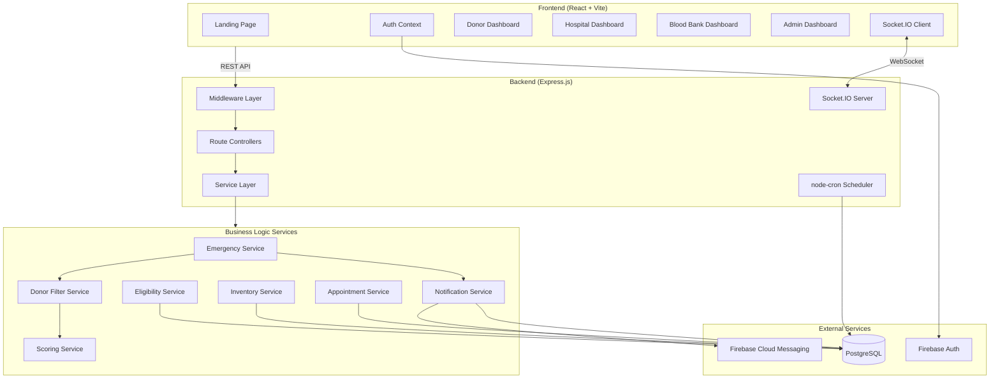
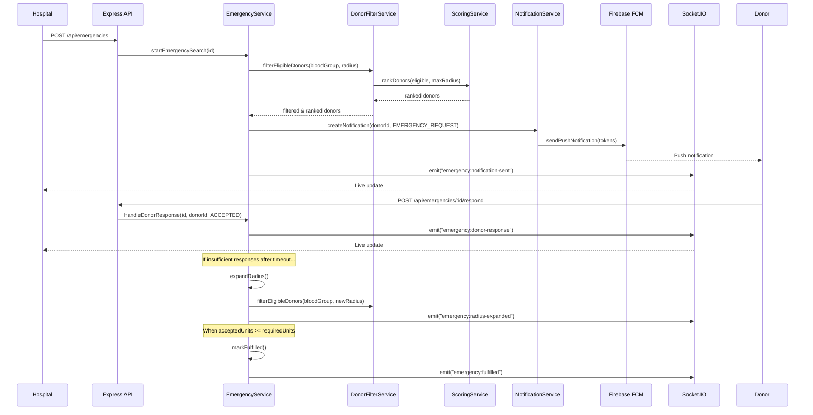
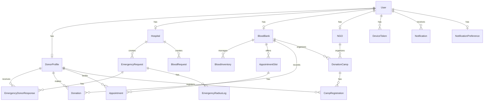

# LifeLink Architecture

## System Overview

LifeLink is a full-stack web application built with a React frontend and Express.js backend, connected via REST API and WebSocket (Socket.IO) for real-time features.

## Architecture Diagram

## Data Flow — Emergency Request

## Entity Relationship Diagram

## Layer Architecture

### Middleware Layer
- **`auth.js`** — Firebase token verification, JWT session management, role-based authorization
- **`validate.js`** — Zod schema validation for request bodies and query parameters
- **`rateLimiter.js`** — Configurable rate limiting per endpoint
- **`errorHandler.js`** — Global error handling with Prisma error translation

### Controller Layer
Controllers handle HTTP request/response and delegate to services:
- `authController` — Firebase verify, JWT issue, logout
- `donorController` — Profile CRUD, availability toggle, dashboard
- `hospitalController` — Registration, emergency CRUD, donor response management
- `bloodBankController` — Inventory, appointments, donations, blood search
- `campController` — NGO registration, camp CRUD, appointments, check-in
- `adminController` — Dashboard analytics, user management, verification
- `notificationController` — Device tokens, notification listing, preferences

### Service Layer
Services contain business logic and are database-aware:
- **`emergencyService`** — Core emergency workflow, radius expansion, donor notification orchestration
- **`donorFilterService`** — Blood compatibility filtering, eligibility check, distance filtering
- **`scoringService`** — Weighted donor ranking algorithm (ML-ready interface)
- **`eligibilityService`** — Configurable eligibility rules from database
- **`inventoryService`** — Transactional inventory operations
- **`appointmentService`** — Appointment booking with overbooking prevention
- **`notificationService`** — FCM push + in-app notification creation

### Utility Layer
- **`bloodCompatibility.js`** — ABO+Rh donor compatibility matrix
- **`distance.js`** — Haversine formula for geo-distance
- **`helpers.js`** — AppError class, async handler, response formatters

## Security Model

1. **Authentication**: Firebase Phone OTP → Firebase ID Token → Backend verification → JWT session
2. **Authorization**: Role-based middleware (`DONOR`, `HOSPITAL`, `BLOOD_BANK`, `CAMP_ORGANIZER`, `ADMIN`)
3. **Data Privacy**: Donor phone numbers only exposed to hospitals for accepted emergency responses
4. **Validation**: Zod schemas on all endpoints
5. **Rate Limiting**: Configurable per-endpoint limits
6. **Audit Trail**: AuditLog table tracks all critical operations

## Configuration

All business rules are database-configurable:
- **`EligibilityRule`** — min age, max age, min weight, donation interval
- **`DonorScoringConfig`** — scoring weights for each factor
- **`EmergencyRadiusConfig`** — radius stages and wait times
